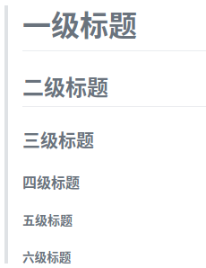

# Markdown

[Markdown](https://github.com/younghz/Markdown)是一种纯文本格式的标记语言。通过简单的标记语法，它可以使普通文本内容具有一定的格式。

---

## 标题

* 语法

```
# 一级标题
## 二级标题
### 三级标题
#### 四级标题
##### 五级标题
###### 六级标题
```

* 效果



---

## 字符效果和横线等

* 语法

```
---　# 分割线 - _ * 三个以上
~~删除线~~ <s>删除线（开启识别HTML标签时）</s>

*斜体字*      _斜体字_

**粗体**  __粗体__

***粗斜体*** ___粗斜体___

上标：X<sub>2</sub>，下标：O<sup>2</sup>

**缩写(同HTML的abbr标签)**
> 即更长的单词或短语的缩写形式，前提是开启识别HTML标签时，已默认开启

The <abbr title="Hyper Text Markup Language">HTML</abbr> specification is maintained by the <abbr title="World Wide Web Consortium">W3C</abbr>.
```

效果

> ----

> ~~删除线~~ <s>删除线（开启识别HTML标签时）</s>

> *斜体字*      _斜体字_

> **粗体**  __粗体__

> ***粗斜体*** ___粗斜体___

> 上标：X<sub>2</sub>，下标：O<sup>2</sup>

> **缩写(同HTML的abbr标签)**
> 即更长的单词或短语的缩写形式，前提是开启识别HTML标签时，已默认开启

> The <abbr title="Hyper Text Markup Language">HTML</abbr> specification is maintained by the <abbr title="World Wide Web Consortium">W3C</abbr>.

---

## 引用

* 语法

`> 这是引用`

* 效果

> 这是引用

---

## 锚点与链接

* 语法

```
[普通](https://www.baidu.com)
[普通带标题](https://www.baidu.com "普通链接带标题")
[锚点链接][maodian-id]
[maodian-id]:www.taobao.com
### 测试{#index}
跳转到[测试](#index)
```

* 效果

[普通](https://www.baidu.com)
[普通带标题](https://www.baidu.com "普通链接带标题")
[锚点链接][maodian-id]
[maodian-id]:https://www.taobao.com
### 测试{#index}


跳转到[测试](#index)

---

## 图片

* 语法

```
 # 可以是网络图片也可以是本地图片
```

* 效果


---

## 代码

* 语法

````
`单行`

```js
let a = 'hello world'
console.log(`这是多行代码：${a}`)
```
````

* 效果

`单行`

```js
let a = 'hello world'
console.log(`这是多行代码：${a}`)
```

---

## 代码区块

* 语法

```
<pre>
    class a:
        __init__(self):
            pass
        run(self):
            pass
</pre>
```

* 效果

<pre>
    class a:
        __init__(self):
            pass
        run(self):
            pass
</pre>

---

## 列表

### 无序列表（减号）

* 语法

```
- 列表一
- 列表二
- 列表三
```

* 效果

- 列表一
- 列表二
- 列表三

### 无序列表（星号）

* 语法

```
* 列表一
* 列表二
* 列表三
```

* 效果

* 列表一
* 列表二
* 列表三

### 无序列表（加号和嵌套）

* 语法

```
+ 列表一
+ 列表二
    + 列表二-1
    + 列表二-2
    + 列表二-3
+ 列表三
    * 列表一
    * 列表二
    * 列表三
```

* 效果

+ 列表一
+ 列表二
    + 列表二-1
    + 列表二-2
    + 列表二-3
+ 列表三
    * 列表一
    * 列表二
    * 列表三

### 有序列表

* 语法

```
1. 第一行
2. 第二行
3. 第三行
```

效果

1. 第一行
2. 第二行
3. 第三行

---

## 表格

### 简单表格

* 语法

```
标题 | 标题 | 标题
------- | ------- | -------
单元格   |  单元格   |  单元格
单元格   |  单元格   |  单元格
```

* 效果

标题 | 标题 | 标题
------- | ------- | -------
单元格   |  单元格   |  单元格
单元格   |  单元格   |  单元格

### 添加一些边框

* 语法

```
| 标题 | 标题 | 标题 |
| ------- | ------- | ------- |
|   单元格  |   单元格  |   单元格  |
|   单元格  |   单元格  |   单元格  |
```

* 效果

| 标题 | 标题 | 标题 |
| ------- | ------- | ------- |
|   单元格  |   单元格  |   单元格  |
|   单元格  |   单元格  |   单元格  |

### 控制单元格的对齐方式

* 语法

```
标题 | 标题 | 标题
:----- | :----: | ------:
左   | 中 | 右
左   | 中 | 右
```

* 效果

标题 | 标题 | 标题
:----- | :----: | ------:
左   | 中 | 右
左   | 中 | 右

---

##　注脚

* 语法

```
使用 Markdown[^1]可以效率的书写文档, 直接转换成 HTML[^2], 你可以使用 Leanote[^Le] 编辑器进行书写。
[^1]:Markdown是一种纯文本标记语言
[^2]:HyperText Markup Language 超文本标记语言
[^Le]:开源笔记平台，支持Markdown和笔记直接发为博文
```

* 效果

使用 Markdown[^1]可以效率的书写文档, 直接转换成 HTML[^2], 你可以使用 Leanote[^Le] 编辑器进行书写。
[^1]:Markdown是一种纯文本标记语言
[^2]:HyperText Markup Language 超文本标记语言
[^Le]:开源笔记平台，支持Markdown和笔记直接发为博文

---

## 参考式

* 语法

```
我经常去的几个网站[Google][1]、[Leanote][2]以及[自己的博客][3]
[Leanote 笔记][2]是一个不错的[网站][]。
[1]:http://www.google.com "Google"
[2]:http://www.leanote.com "Leanote"
[3]:http://http://blog.leanote.com/freewalk "梵居闹市"
[网站]:http://http://blog.leanote.com/freewalk
```

* 效果

我经常去的几个网站[Google][1]、[Leanote][2]以及[自己的博客][3]
[Leanote 笔记][2]是一个不错的[网站][]。
[1]:http://www.google.com "Google"
[2]:http://www.leanote.com "Leanote"
[3]:http://http://blog.leanote.com/freewalk "梵居闹市"
[网站]:http://http://blog.leanote.com/freewalk

___
> 共同学习，共同进步
